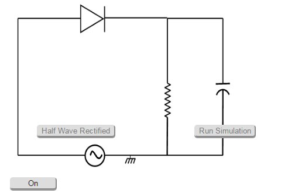
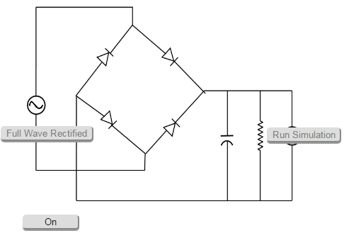

### Procedure

### Capacitative Rectification for Half Wave Rectifier

- Take a diode, and Load resistor of 1KOhms and capacitor of 102μF.
- Connect to AC Voltage Source of 50 Hz, 2 V
- Click on 'ON' button to make the circuit on.
- Click on 'Sine Wave' button to observe the input waveform.
- lick on 'Run Simulation' button to observe the filtered waveform.
- Observe the corresponding waveform.
- Channel 1 shows the input wave, Channel 2 shows the output wave and Dual shows both the input and output wave.

Figure:1

### Capacitative Rectification for Full Wave Rectifier

- Take 4 diodes, Load resistor of 1KOhms and capacitor of 102μF.
- Connect to AC Voltage Source of 50 Hz, 12 V.
- Click on 'ON' button to make the circuit on.
- Click on 'Sine Wave' button to observe the input waveform.
- Click on 'Run Simulation' button to observe the filtered waveform.
- Vary the amplitude using the controllers.
- Observe the corresponding waveform.
- Channel 1 shows the input wave, Channel 2 shows the output wave and Dual shows both the input and output wave.

Figure:2

