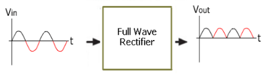
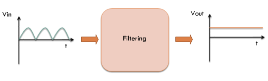
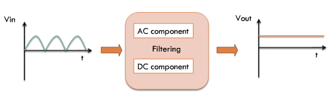
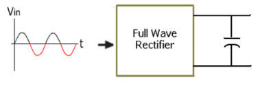
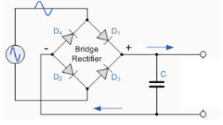
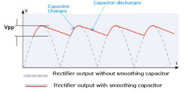
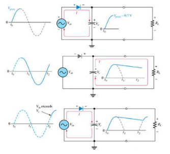
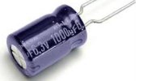
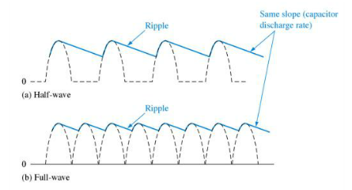

# Theory

### Rectifier

In our earlier experiment we have seen that a full-wave rectifier is exactly the same as the half-wave, but allows unidirectional current through the load during the entire sinusoidal cycle (as opposed to only half the cycle in the half-wave). A full-wave rectifier converts the whole of the input waveform to one of constant polarity (positive or negative) at its output.

Figure 1  

### Filter

Figure 2  

What is really desired is to convert the pulsating output of the rectifier to a constant DC supply. Thus we would like to ‘filter’ the pulsating input signal.

Figure 3  

We can do this by splitting the input waveform into AC (high frequency) and the DC components (very low frequency) and by then ‘rejecting’ the high frequency components.

### Filtering

From our filtering experiments we have seen that the simplest kind of filter that can perform the filtering task just described is a capacitor. Thus, if we connect a capacitor directly across the output of a rectifier, the AC components will ‘see’ a low impedance path to ground and will not, therefore appear in the output.

Figure 4  

### Full Wave Rectification + Filtering

The smoothing capacitor converts the full-wave rippled output of the rectifier into a smooth DC output voltage. The smoothing capacitor acts as a tank.

Figure 5  

### Ripple Voltage and Ripple Factor

Assuming a finite capacitor is connected, since a new charging pulse occurs every half cycle the capacitor charges and discharges very frequently. We can observe that smaller the Vpp, the more the waveform will resemble a pure DC voltage. The variable portion is known as ‘ripple’ and the value Vpp is known as the ripple voltage. Further the ratio of the ripple voltage to the DC or average voltage is known as the ripple factor.

Figure 6  

### ‘Filling the Gaps’

So we see that, a capacitor-input filter will charge and discharge such that it fills in the “gaps” between each peak. This reduces variations of voltage. As we have seen, the remaining voltage variation is called ripple voltage.

Figure 7  

### Choosing the Capacitor

Since a rectifier circuit is designed with a particular load in mind, choosing the capacitor needs careful analysis. Since low ripple factors a desired, choosing a large capacitance value is not practical. This is because larger capacitance will cost more and will create higher peak currents in the transformer secondary and in the supply feeding it. In the subsequent experiments, let us see how time constant plays a role in the rectified output waveform shape and characteristics.

Figure 8  

### Half Wave vs Full Wave Capacitive Rectification

If the capacitance and voltage sources used are the same, which one among the two – half wave or full wave gives lesser ripple effect ?

The advantage of a full-wave rectifier over a half-wave is quite clear. The capacitor can more effectively reduce the ripple when the time between peaks is shorter.

Figure 9  

